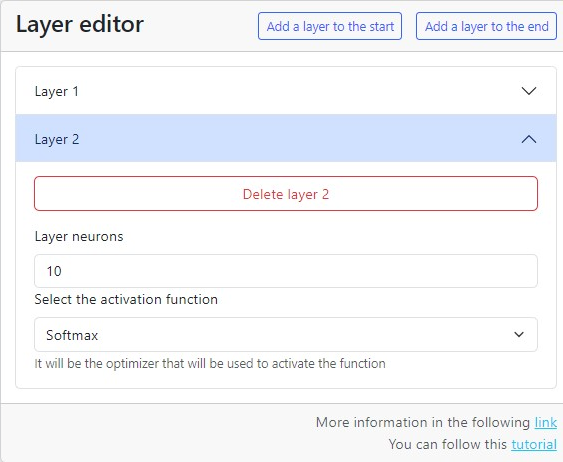

# Tabular classification - Layer editor

The layer editor allows you to modify the layers of a neural network architecture of the model to be generated.

You can visit the glossary to discuss which activation function is most useful to the task and dataset you are using.

In this case we are going to make our model classify very quickly.

[//]: # (By default the layer editor comes with the following architecture:)
[//]: # (1. Layer 1:)
[//]: # ( 1. Activation function: Sigmoid)
[//]: # ( 2. Units: 10)
[//]: # ( 2. Layer 2:)
[//]: # (Activation function: Softmax&#41; [//]: # &#40; 1. Activation function: Softmax&#41;)
[//]: # ( 2. Units: 10)
[//]: # ()
[//]: # ( ![03-editor-layers-0.png {server}]&#40;../images/00-tabular-classification/03-editor-layers-0.png&#41;)

We will give the following configuration to the architecture:

1. Layer 1:
    1. activation function: ReLU
    2. Units: 10
2. Layer 2:
    1. Activation function: ReLU 2.
    2. Units: 10
3. Layer 3:
    1. Activation function: Softmax 2.
    2. Units: 4

The layer viewer should display the following configuration:

[03-editor-layers-3-result.png {server}](../images/00-tabular-classification/03-editor-layers-3-result.png)

We must remember that in a tabular classification model the last layer must have a **Softmax** activation function and as many units as classes to predict.
This gives us as output of the model a numerical vector of the size of the number of classes, the sum of the vector must give 1 which corresponds to 100% prediction, each element of the vector will correspond to the percentage of predictions of that class.