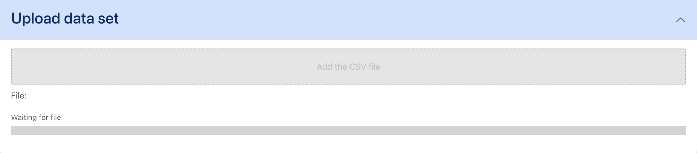

# Clasificación tabular - Subir y procesar el conjunto de datos

Para este tutorial explicaremos primero los componentes, la función que realizan y luego un ejemplo sencillo de como usar la aplicación.

